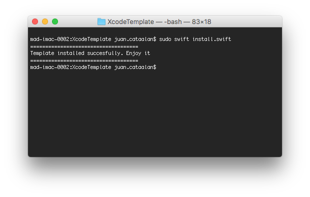

When you decide to use VIPER architecture in your project, it is very tired create new modules, because you need create at least 5 files for each. Imagine that you need to create 6 modules...I was suffering this problem, and this is the raison why I've created this template. It's very useful for me and I hope that for you too.

## How to install

### Using script (easy)
Only need execute this command in terminal:
```swift
sudo swift install.swift
```
You should be this output message:



If all it's ok you now could find your template in Xcode.

### Manual
Go to Application folder, browse to the Xcode application icon. Right-click it and choose 'Show Package Contents'. Then browse to:
`Contents/Developer/Platforms/iPhoneOS.platform/Developer/Library/Xcode/Templates/Project Templates/iOS/Application` and add "Module VIPER.xctemplate" file. Now you can find your template in Xcode.

## Easy to use


## Generated code
This template generates all files that you need to create a new VIPER module. All generated code is Swift 3.

This is an example, we're creating a Login module:

- [Default, without divide](/assets/defaultOutput.md)
- [With divided Interactor (Input & Output)](/assets/inputOutput.md)

## VIPER diagram overview


## Why VIPER?
After using VIPER, I've found it to be very beneficial in many ways. Let’s get back to the list of things we set out to accomplish when architecting our app to see if VIPER addresses them.

- Easy to iterate on
- Collaboration friendly
- Separated out concerns
- Spec-ability

## Next steps

Would you like decide what will be the next feature? now, you can do it [here](https://goo.gl/forms/8SrF30p7ort0hCio2)

* [x] Create bash script to install more easy
* [x] Divide Interactor protocol (Input & Output) (**NEW!** Version 1.1)
* [x] Swift 4 & XCode 9 (**NEW!** Version 1.2)
* [ ] Add Dependency Injection Framework
* [ ] Customize name of components
* [ ] ~~Create groups in template~~ *(Only available for Project templates)*

## References
- [iOS Architecture Patterns](https://medium.com/ios-os-x-development/ios-architecture-patterns-ecba4c38de52#.ba7q8dcih)
- [#8 VIPER to be or not to be?](https://swifting.io/blog/2016/03/07/8-viper-to-be-or-not-to-be/)
- [https://www.objc.io/issues/13-architecture/viper/](https://www.objc.io/issues/13-architecture/viper/)
- [https://www.ckl.io/blog/ios-project-architecture-using-viper/](https://www.ckl.io/blog/ios-project-architecture-using-viper/)

## Contributed
This is an open source project, so feel free to contribute. How?
- Open an [issue](https://github.com/Juanpe/Swift-VIPER-Module/issues/new).
- Send feedback via [email](mailto://juanpecatalan.com).
- Propose your own fixes, suggestions and open a pull request with the changes.

## Author

* Juanpe Catalán [🐦](https://www.twitter.com/juanpecmios)
